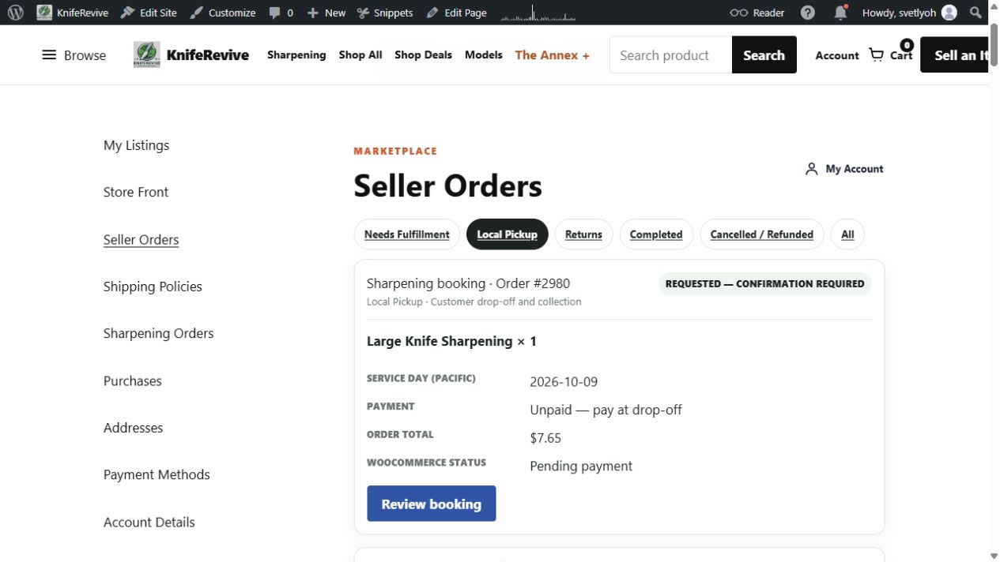
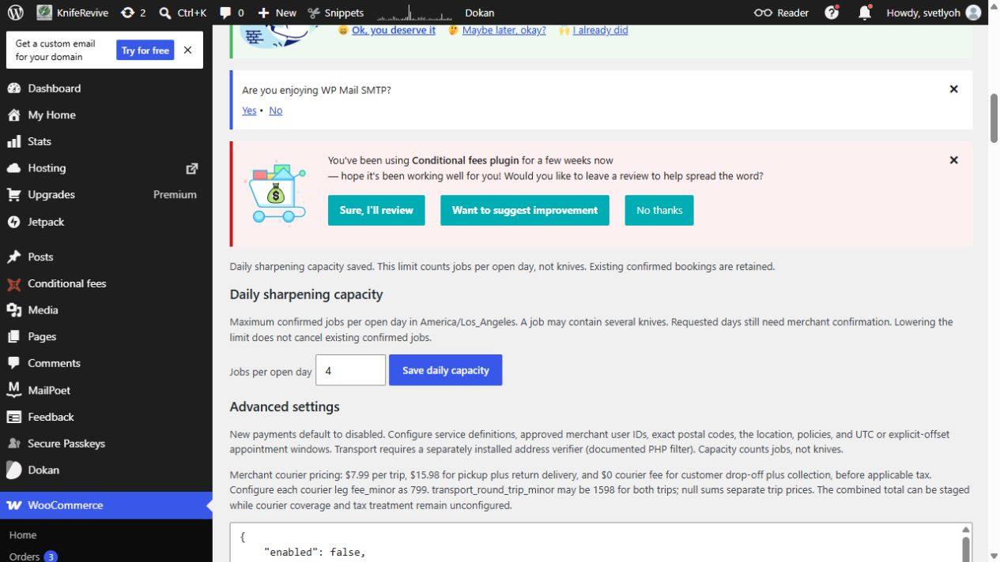

# Seller Orders booking visibility and daily capacity — October 8, 2026

Agent Commerce **0.4.2** and the narrow Seller Orders **1.1.5** overlay are deployed after the owner's existing deployment approval. Native unpaid order **2980** now appears once in [Seller Orders → Local Pickup](https://kniferevive.com/my-account/seller-orders/?tab=local-pickup), with Large Knife Sharpening × 1, October 9 requested day, $7.65 native total and unpaid status. Its Review booking link opens the authenticated, focused request inbox. All seven changed live PHP files match tested source after line-ending normalization.

The owner requested **4 jobs per open day**. The setting was saved and read back as 4; comparison with the prior settings shows only `booking_daily_capacity` changed. The new dedicated form was then exercised with the same value and preserved every other setting. Manage it at [WooCommerce → Agent Commerce → Daily sharpening capacity](https://kniferevive.com/wp-admin/admin.php?page=krev-agent-commerce#daily-sharpening-capacity): change **Jobs per open day**, then **Save daily capacity**. It counts jobs, not individual knives, in America/Los_Angeles. Lowering it retains existing confirmed jobs; requests still require merchant confirmation. Server validation permits whole numbers 1–200 and requires `manage_woocommerce` plus the form nonce.

## Incident findings

| Finding | Evidence | Resolution |
| --- | --- | --- |
| Native order already belongs to its service seller | Prior native Dokan query, vendor metadata and commission verification for 2980 | Reuse that order; no migration or second order |
| Custom Seller Orders is separate from native Dokan Orders | Production 1.1.4 permissions/reader exclude sharpening services from merchandise rows; only operators get a special sharpening list | Add a read-only, authorized appointment adapter and render slot |
| Operator view duplicated the order | Before-patch Local Pickup showed legacy sharpening and generic rows for 2980 | Filter matching native IDs from both old loops |
| Attempted confirmation remained requested | Capacity was null; `Booking::confirm` rejects `CAPACITY_UNCONFIGURED` | Explain missing capacity and disable confirmation until configured; owner set 4 |
| Administrator native link went to a different seller's dashboard | Existing native seller detail correctly denied that session | Managers get the WooCommerce edit link; owning sellers retain native Dokan link |

The marked integration test (`13a320ac5e0f014c4ab89356c6f4209e`) remains **requested / pending / unpaid**. Its note explicitly says it is not a real appointment. This patch did not submit another booking, create an order, confirm the test, issue a charge/refund, or retry mail. Confirmation is now available to the merchant for actual requests.

## Implementation and validation

Agent Commerce supplies cards for authorized linked native drop-off/collection bookings in Local Pickup and All. It validates active product ownership, stored seller, both native vendor markers, shipping method, product IDs and exact quantities. Cards contain service/day/order facts and a nonsecret reference; no customer contact, bearer token or order key. Request inbox access remains authenticated and seller-scoped. Merchandise fulfillment, returns and refund permissions are unchanged. The inbox's existing recent-record limits remain: latest 500 records scanned, up to 50 authorized requests shown.

Seller Orders is packaged against the **captured live 1.1.4 baseline**, not the unrelated local 1.2.0 work. Four files change: entry/version, endpoint, list template and schema-version comparison. The UI release retains schema version 1.1.4, preventing an unnecessary schema installation/backfill. The booking card uses the existing stacked card styles; the live desktop card has no internal horizontal overflow and its action stays inside the card.

**348 synthetic checks passed:** 87 in each classic/HPOS × sync on/off combination, using the full captured Seller Orders baseline plus overlay and real installed WooCommerce/Dokan stack. Checks include owning/foreign/logged-out/disabled/transferred sellers, invalid native attribution/shipping, no read-side creation/mail/events, native totals, absent-capacity refusal, actual endpoint rendering/duplicate suppression, escaped service titles, capacity setting isolation and permission/range rejection. Existing bridge recovery, commissions, races and notification failure/retry checks passed. PHP syntax passed in 31 files; the subsequent one-class layout refinement separately passed syntax and live visual/DOM verification. External mail and processor calls are intercepted in the isolated sandbox; this is not processor or security certification.

Live verification: actual Local Pickup card, authenticated focused inbox, administrator WooCommerce link, enabled confirmation control after capacity configuration, dedicated capacity POST/readback, seven source matches, and preserved paid gates. The actual owning-seller browser login remains a separate manual check; the available live session has administrator capabilities. Seller-only rendering and denial are proven with synthetic enabled seller accounts, not impersonation or broader permissions.

The owner reports inbox arrival. The connected mailbox verifies one seller sharpening-request message for the new reference. The separately inspected “booking requested” message is for the earlier reference `167c8b10ecc1d73f6ec1600d8b373ee5`; account-creation mail is not evidence of three distinct booking recipients. Prior three recipient jobs/mailer acceptance remain documented. No new email-delivery claim is made by this patch.

One installer navigation briefly reported a missing `wp-mail-smtp/polyfills.php` file. Reload recovered without disabling or changing SMTP; subsequent settings, installer and account pages loaded successfully. Its cause was not established.

## Packages, rollback and publication

The [sanitized report](seller-booking-visibility-0.4.2.json) includes component hashes and source-readback results. To rebuild Seller Orders, provide the exact owner-held baseline to:

```powershell
python tools/package_seller_orders_overlay.py <path-to-captured-kniferevive-seller-orders-1.1.4>
```

The builder refuses changed/missing/extra baseline files and emits both rollback 1.1.4 and candidate 1.1.5 ZIPs. Baseline hashes are in `wordpress-overlays/kniferevive-seller-orders/baseline-manifest.json`; the private captured files stay outside Git. Rebuild Agent Commerce with `python tools/package.py`. To reproduce the overlay stack tests, set `KREV_LISTING_TEST_STACK=1` and `KREV_SELLER_ORDERS_CANDIDATE=1`, then run the fenced storage/bridge scripts against the isolated database on port 11019. They never load production/local `wp-config.php`.

Rollback through the native WordPress uploader with the retained Seller Orders 1.1.4 ZIP and Agent Commerce 0.4.1 ZIP. Retain current booking/order records and the approved capacity 4 unless the owner separately requests changing it; no refund or order deletion is needed. Seller Orders' original schema version is unchanged. Existing prepaid/wallet readiness gates stay off; no Stripe mode/keys, shipping fees, seller ownership, gateway enablement, callback integration or ClawHub publication was changed. The original historical booking was not converted or resent.

Source remains on the existing draft PR #2; no merge, tag or registry release. Published ClawHub skill remains 0.3.0, distinct from the source skill candidate 0.4.0 and deployed plugin 0.4.2.




