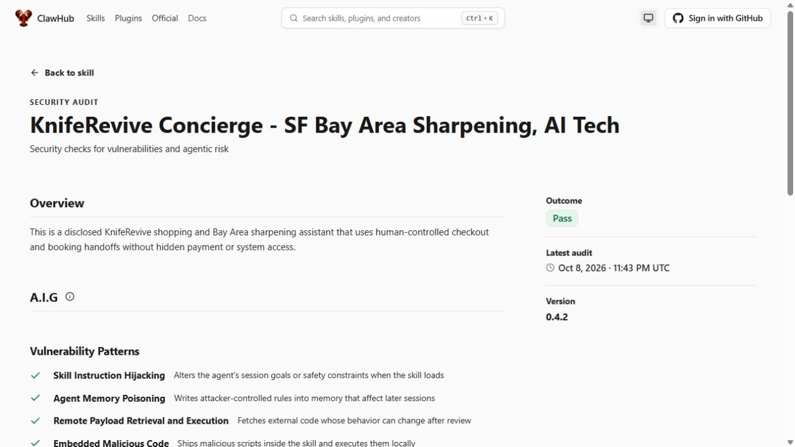

# Skill release 0.4.2 — October 8, 2026

The owner explicitly requested the next ClawHub publication after the live booking visibility/capacity fix. Release 0.4.2 aligns the portable skill with deployed Agent Commerce 0.4.2; unpublished source version 0.4.0 is superseded, not retroactively published.

Changes since published 0.3.0 include separate contact/payment authorization guidance, choice-only booking drafts, opaque human referral handoff, scoped booking/order events and truthful unpaid native order receipts. The current release clarifies that capacity counts jobs rather than knives, an unpaid seller Local Pickup order does not confirm the day, and hosting/API failures use the direct first-party human booking form. Installation references point to the immutable 0.4.2 source; duplicate stale candidate notices are removed.

The skill remains eight text files with MIT-0 license, no generated-card forgery, installers, runtime shell requirement, credentials, wallet provisioning, callbacks or background promotion. No merchant setting, paid gate, Stripe mode or wallet authority is changed by publication. Source entry validation and the supported ClawHub CLI dry-run passed; publisher authentication identifies `svetlyoh`. Title, slug, Lifestyle category and four existing topics are preserved.

**Published and verified:** [ClawHub latest](https://clawhub.ai/svetlyoh/skills/kniferevive-concierge) is 0.4.2. The [exact-version public audit](https://clawhub.ai/svetlyoh/skills/kniferevive-concierge/security-audit?version=0.4.2) shows **Pass**, with clean moderation, benign/high-confidence AI review and no registry warnings. Static analysis reports no suspicious patterns. VirusTotal and SkillSpector reports are null, so no completed passing results are claimed for those scanners. The initial submission was held for automated scans, then published; it was not resubmitted.

All eight registry file hashes match the immutable Git source at `213700557735745443e60f3a8de5bf9f95a5d48a`. An actual ClawHub CLI install into an isolated local verification directory succeeded, and all eight downloaded file hashes match as well. No skill execution or native adoption in an active OpenClaw/Muse/Grok/dot agent was performed.

**Separate verification limit:** `clawhub skill verify --version 0.4.2` reports `ok=false`, `decision=fail`, reason `card.missing`, while its security check reports clean/passed and benign/high confidence. The registry-generated `skill-card.md` is unavailable. No card was authored or uploaded to bypass this. Server-resolved GitHub import provenance is also null despite supplying source repository/ref/commit/path; independent file matching does not replace that provenance. The registry install itself succeeds. This is a published skill and passing public security audit, not a claim of complete trust-card verification or certification.

Source and package: [immutable skill directory](https://github.com/svetlyoh/kniferevive-agent-commerce/tree/skill-v0.4.2/skills/kniferevive-concierge), [GitHub prerelease](https://github.com/svetlyoh/kniferevive-agent-commerce/releases/tag/skill-v0.4.2), [complete skill ZIP](https://github.com/svetlyoh/kniferevive-agent-commerce/releases/download/skill-v0.4.2/kniferevive-concierge-0.4.2.zip). Source remains on draft PR #2; no merge occurred. [Sanitized publication evidence](skill-publication-0.4.2.json) records fingerprints, per-file comparisons, actual scan reports/archive hash and verification limits. Historic 0.3.0 scanner warnings remain historical evidence and are not silently overwritten.

Install with an already configured OpenClaw environment:

```text
openclaw skills install @svetlyoh/kniferevive-concierge
openclaw skills check
```

The ClawHub CLI's tested registry-download command is `clawhub install @svetlyoh/kniferevive-concierge --version 0.4.2`. Installation does not grant contact-sharing or payment authority and does not enable prepayment. Review the versioned source and actual host capabilities before use.


