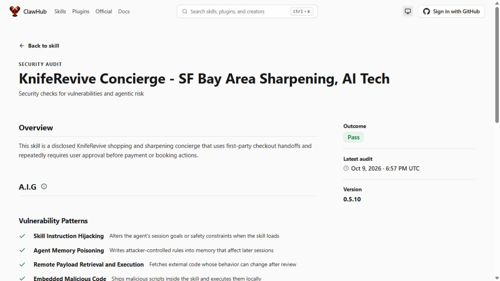

# KnifeRevive Concierge 0.5.10 — October 9, 2026

Published under the owner's explicit request using the existing `svetlyoh` publisher authentication. [ClawHub](https://clawhub.ai/svetlyoh/skills/kniferevive-concierge) now resolves `latest` to **0.5.10**. Title, Lifestyle category and the four existing topics are preserved. The initial upload was held for checks and then published; no duplicate submission or forced pending install was used.

The skill offers five clear sharpening choices, including delivery-only and unpaid customer drop-off/collection last with “nothing due now”. It discloses the sharpening amount separately and taxable trip fees once per order: $6 pickup or delivery, $11 pickup plus delivery. It documents the two-screen flow, required coverage checks, independent contact/payment authorization, and separate appointment, payment, cancellation and refund states. Installation notes now include an exact-version registry download and active-copy/session checks.

The [exact-version public audit](https://clawhub.ai/svetlyoh/skills/kniferevive-concierge/security-audit?version=0.5.10) shows **Pass**. Registry moderation is clean, AI review is benign with high confidence, and static analysis has no findings. Registry security reports no warnings at this observation. VirusTotal and SkillSpector reports are null, so completed passing results are not claimed for those scanners.

All eight authored registry files match the tagged GitHub source at `3cb8412595f6cb89f03e2f3fb0666262b2a13f1d`. A fresh ClawHub CLI installation into an isolated verification directory succeeded, and all eight installed files match as well. No active buyer-bot installation or skill execution was performed.

Separate full verification currently reports `ok=false`, `decision=fail`, reason `card.missing`, although its security result is clean/passed. The registry-generated Skill Card and server-resolved import provenance are unavailable at this observation. No card was authored to bypass this. Independent byte comparisons do not replace server-issued provenance. This is a published skill with a passing public audit, not complete trust-card certification.

[Versioned source](https://github.com/svetlyoh/kniferevive-agent-commerce/tree/skill-v0.5.10/skills/kniferevive-concierge), [GitHub release and complete skill ZIP](https://github.com/svetlyoh/kniferevive-agent-commerce/releases/tag/skill-v0.5.10), [hash manifest](skill-release-manifest-0.5.10.json), and [sanitized publication evidence](skill-publication-0.5.10.json).

Exact registry download with an already installed ClawHub CLI:

```text
clawhub install @svetlyoh/kniferevive-concierge --version 0.5.10
```

Existing active installations use their host's supported update/replace flow. Verify the active copy's metadata version and reload a new agent session. Publication does not enable merchant settings, grant wallet spending authority, change Stripe mode, create a booking or execute a payment. Real processor/refund settlement and headless hosting access remain independently unverified.


